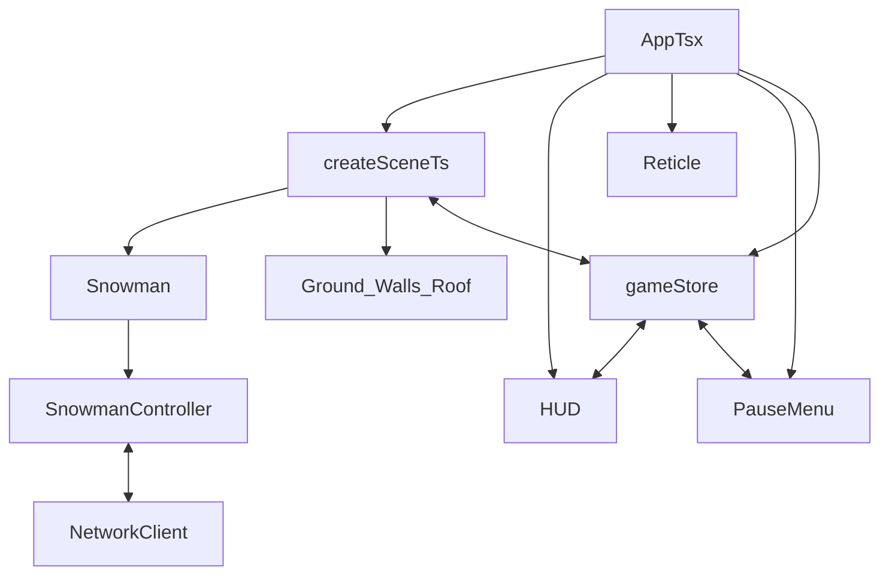

## Medium-term roadmap for `client/`

### 1. Solidify core player control & camera feel

- **Goal**: Make basic movement and camera feel smooth and FPS-like before adding more systems.
- **Key files**: [`client/src/game/engine/createScene.ts`](client/src/game/engine/createScene.ts), [`client/src/game/entities/Snowman.ts`](client/src/game/entities/Snowman.ts), [`client/src/game/controllers/SnowmanController.ts`](client/src/game/controllers/SnowmanController.ts).
- **Steps**:
  - Ensure `Snowman` exposes clear APIs for movement/rotation (e.g. `moveForward`, `strafe`, `rotate`, `jump`).
  - In `SnowmanController`, implement WASD + mouse look using Babylon input or manual key state tracking.
  - In `createScene.ts`, keep `UniversalCamera` mostly driven by the snowman entity (e.g. position based on snowman transform) instead of free-flying.
  - Add basic movement constraints (ground collision, clamp Y, prevent exiting wall boundary).

### 2. Interaction with world objects (ground, walls, roof)

- **Goal**: Make the environment feel physical and reactive, not just background meshes.
- **Key files**: [`client/src/game/world/ground.ts`](client/src/game/world/ground.ts), [`client/src/game/world/Walls.ts`](client/src/game/world/Walls.ts), [`client/src/game/world/Roof.ts`](client/src/game/world/Roof.ts).
- **Steps**:
  - Enable collisions between the player and ground/walls/roof using Babylon physics or mesh collisions.
  - Add simple interaction zones on walls/ground (e.g. highlight when looking at them via a raycast from camera).
  - Introduce at least one interactable (e.g. a door or switch on a wall) and wire a simple state toggle in the scene.

### 3. Basic game loop & state management

- **Goal**: Move from sandbox scene to a simple game loop with win/lose conditions.
- **Key files**: [`client/src/state/gameStore.ts`](client/src/state/gameStore.ts), [`client/src/App.tsx`](client/src/App.tsx), [`client/src/game/engine/createScene.ts`](client/src/game/engine/createScene.ts).
- **Steps**:
  - Define core game states in `gameStore` (e.g. `"menu" | "playing" | "paused" | "gameOver"`).
  - Expose actions like `startGame`, `pauseGame`, `resumeGame`, `endGame` and wire them to scene events (e.g. reaching an area, timer expiry).
  - In `App.tsx`, switch UI overlays based on game state (show menu, HUD, pause menu, etc.).
  - From `createScene.ts`, trigger store actions via callbacks or a simple event bus (e.g. when the player reaches a goal area).

### 4. HUD, reticle, and pause menu polish

- **Goal**: Make the game feel cohesive through UI feedback.
- **Key files**: [`client/src/ui/HUD.tsx`](client/src/ui/HUD.tsx), [`client/src/ui/Reticle.tsx`](client/src/ui/Reticle.tsx), [`client/src/ui/PauseMenu.tsx`](client/src/ui/PauseMenu.tsx), [`client/src/style.css`](client/src/style.css).
- **Steps**:
  - Make `HUD` consume `gameStore` (health, score, objective text) and display simple metrics.
  - Improve `Reticle` to reflect interaction state (e.g. change color when aiming at interactable, or when pointer lock is off).
  - Wire `PauseMenu` to `gameStore` actions (`pauseGame`, `resumeGame`, `quitToMenu`).
  - Apply consistent styling in `style.css` (font, colors, layout) for a clean, minimal HUD.

### 5. Networking hooks (prepare for multiplayer or server sync)

- **Goal**: Introduce a thin networking layer to sync basic player state, without overcomplicating.
- **Key files**: [`client/src/game/network/NetworkClient.ts`](client/src/game/network/NetworkClient.ts), [`client/src/state/gameStore.ts`](client/src/state/gameStore.ts), [`client/src/game/entities/Snowman.ts`](client/src/game/entities/Snowman.ts).
- **Steps**:
  - Implement `NetworkClient` with simple connect/disconnect and send/receive message methods (e.g. WebSocket wrapper).
  - Define a minimal protocol (e.g. messages for `playerMove`, `playerState`, `gameStateUpdate`).
  - From `Snowman` or `SnowmanController`, publish local movement updates through `NetworkClient`.
  - In `gameStore`, subscribe to server messages and update remote player representations (can start with logging and a simple ghost entity).

### 6. Small visual polish & performance passes

- **Goal**: Keep the scene performant and visually coherent as features grow.
- **Key files**: same as above plus [`client/src/main.tsx`](client/src/main.tsx).
- **Steps**:
  - Ensure textures from `public/` are correctly sized/compressed; adjust repeating/tiling on ground and walls for clarity.
  - Add simple lighting tweaks or fog to improve depth perception.
  - Profile frame rate at different resolutions and limit heavy operations in each render loop tick.

### High-level flow (conceptual)

This roadmap should comfortably cover ~1–2 weeks of part-time work, focusing first on control/feel, then interactions and state, then networking hooks and polish.